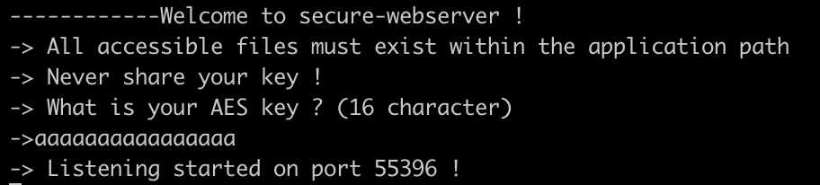
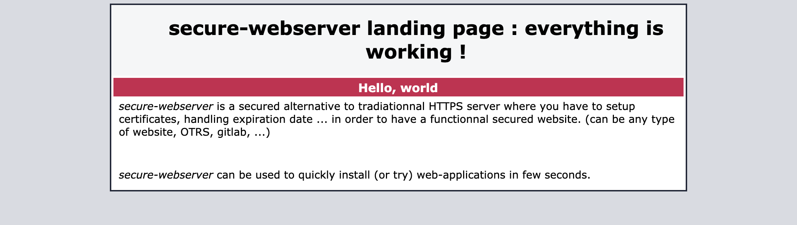

# secure-webserver
## what is secure-webserver
**secure-webserver** is composed of two elements : a server and a client. 
Both must share the same AES 16-character key (126 bits), the client will request a page : eg. /coolstuff.html -> the server will send an encrypted version of the coolstuff.html file. 
Then, the client will decrypt the received file and open it using the default browser. All requests are made via HTTP, but content is encrypted. 
For now, PHP is not supported.
## Purpose
**secure-webserver** is usefull to setup an easy encrypted web-server without all the pain to manage any kind of certificate. 
With this software, the only mandatory thing to do is to share a 16 character long key between the client and the server.  
**secure-webserver** is crossplatform (mac, windows, linux). 
## Example
Server configuration :
  

  
What you see when you navigate with your default browser :
  

  
Client configuration :
  

  
The final result when you access the website from the client :
  

## Licences
- plusaes (for aes encryption-decryption) - MIT
- cpp-httplib (for http request handling) - MIT
- secure-webserver - MIT
